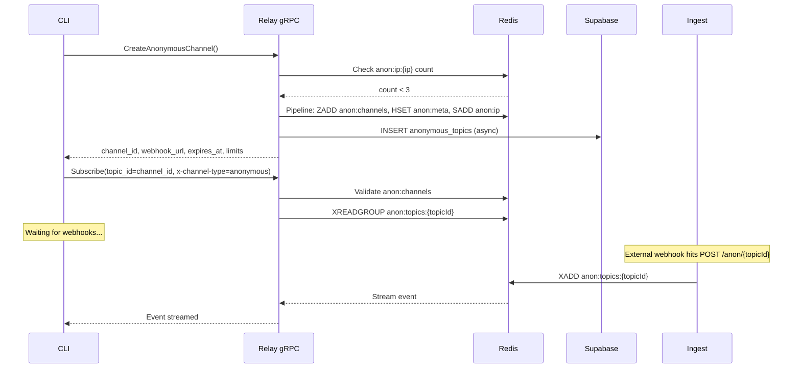

# Anonymous Ephemeral Channels Implementation

## Key Architecture Decision

The CLI only communicates with the relay (gRPC). Anonymous channel creation happens on the **relay**, not the ingest server. The relay already has both Redis and Supabase clients.



## Redis Key Naming Convention

All Redis keys organized by namespace:

### Event streams (webhook payloads)

| Key                     | Type   | Purpose                                                                                                 |
| ----------------------- | ------ | ------------------------------------------------------------------------------------------------------- |
| `topics:{topicId}`      | Stream | Webhook events for authenticated topics (written by ingest `POST /topics/{topicId}`, read by relay)     |
| `anon:topics:{topicId}` | Stream | Webhook events for anonymous ephemeral topics (written by ingest `POST /anon/{topicId}`, read by relay) |

The rename from the legacy prefix to `topics:` is tracked in the [redis stream pruning plan](/.cursor/plans/redis_stream_pruning_bdbbd34e.plan.md) (that plan currently uses `topic:` singular -- needs updating to `topics:` plural for consistency with routes).

### Anonymous channel management (`anon:*` namespace)

| Key                        | Type       | TTL               | Purpose                                                                                    |
| -------------------------- | ---------- | ----------------- | ------------------------------------------------------------------------------------------ |
| `anon:channels`            | Sorted Set | none              | Registry of all active anonymous channels. Score = expiry timestamp (ms), member = topicId |
| `anon:meta:{topicId}`      | Hash       | 2h                | Channel metadata: ip, created_at, expires_at, disabled                                     |
| `anon:ip:{ip}`             | Set        | 2h                | Active anonymous topicIds for this IP (max 3 enforced via SCARD)                           |
| `anon:connected:{topicId}` | String     | 2h                | Exists when a CLI is connected to this anonymous channel                                   |
| `anon:topics:{topicId}`    | Stream     | cleaned by pruner | Webhook event stream for anonymous topics (listed above, repeated for completeness)        |

### Rate limiting (`rl:*` namespace)

Rate limit keys use sorted sets as sliding windows. Each request adds a timestamped member; `ZCARD` counts requests in the window. These are created/managed by the rate limiting middleware on the ingest server.

**Anonymous topics** -- always Anon tier (10/min burst, 100/day quota):

| Key                     | Type       | Purpose                                             |
| ----------------------- | ---------- | --------------------------------------------------- |
| `rl:anon:{topicId}:min` | Sorted Set | Per-minute burst sliding window for anonymous topic |
| `rl:anon:{topicId}:day` | Sorted Set | Daily quota sliding window for anonymous topic      |

**Authenticated topics** -- tier resolved from topic owner's subscription (Starter/Pro/Scale/Enterprise):

| Key                       | Type       | Purpose                                                 |
| ------------------------- | ---------- | ------------------------------------------------------- |
| `rl:topics:{topicId}:min` | Sorted Set | Per-minute burst sliding window for authenticated topic |
| `rl:topics:{topicId}:day` | Sorted Set | Daily quota sliding window for authenticated topic      |

The key builder (from [rate limiting plan](/.cursor/plans/rate_limiting_implementation_2e9a2813.plan.md)):

```go
// prefix is "anon" or "topics", matching the ingest route
func RateLimitKey(prefix string, topicID string) string {
    return fmt.Sprintf("rl:%s:%s", prefix, topicID)
}
```

Scannable: `SCAN 0 MATCH rl:anon:*` for all anonymous rate limit keys, `SCAN 0 MATCH rl:topics:topic_abc123:*` for a specific authenticated topic.

### Tier cache (authenticated only)

| Key              | Type   | TTL  | Purpose                                                                          |
| ---------------- | ------ | ---- | -------------------------------------------------------------------------------- |
| `tier:{topicId}` | String | 5min | Cached tier name for an authenticated topic (avoids Supabase lookup per request) |

## Alignment with Rate Limiting Plan

**Discrepancies to resolve:**

- **Anon tier limits:** Master plan says 5/min, 50/day. [Rate limiting plan](/.cursor/plans/rate_limiting_implementation_2e9a2813.plan.md) says 10/min, 100/day. Recommendation: use 10/min, 100/day for a better trial experience. Update master plan.
- **Route structure:** Rate limiting plan's two-route split (`/topics/` and `/anon/`) is adopted. Webhook URL returned by the relay uses `/anon/{topicId}` format.
- **Stream key update needed:** The rate limiting plan's `HandleAnonWebhook` handler must publish to `anon:topics:{topicId}`. The `HandleTopicWebhook` handler must publish to `topics:{topicId}`. The [redis stream pruning plan](/.cursor/plans/redis_stream_pruning_bdbbd34e.plan.md) needs updating from `topic:` (singular) to `topics:` (plural).

**Already handled by rate limiting plan (no duplication):**

- `/anon/{anonTopicID}` route and `ForAnon` middleware on ingest
- `HandleAnonWebhook` handler on ingest (publishes to `anon:topics:{topicId}` stream)
- `anonymous_topics` Supabase migration
- Anon tier constants in `ratelimit/tier.go`
- Rate limit key creation (`rl:anon:{topicId}:min/day` and `rl:topics:{topicId}:min/day`)

## Part 1: Proto Changes

Add a new RPC and messages to [backend/relay/proto/relay.proto](backend/relay/proto/relay.proto) (and the CLI copy at [cli/proto/relay.proto](cli/proto/relay.proto)):

```protobuf
service RelayService {
  // ... existing RPCs ...

  // Create an anonymous ephemeral channel (no auth required)
  rpc CreateAnonymousChannel(CreateAnonymousChannelRequest) returns (CreateAnonymousChannelResponse);
}

message CreateAnonymousChannelRequest {
  // Empty - relay reads client IP from the connection/metadata
}

message CreateAnonymousChannelResponse {
  string channel_id = 1;
  string webhook_url = 2;           // e.g. "https://ingest.hookie.sh/anon/anon_xxx"
  int64 expires_at = 3;             // Unix timestamp (seconds)
  AnonymousLimits limits = 4;
}

message AnonymousLimits {
  int64 requests_per_day = 1;
  int64 requests_per_minute = 2;
  int64 max_payload_bytes = 3;
}
```

Regenerate protobuf code for both `backend/relay/proto/` and `cli/proto/`.

## Part 2: Relay -- CreateAnonymousChannel RPC

New method on the relay service in [backend/relay/internal/grpc/service.go](backend/relay/internal/grpc/service.go):

```go
func (s *Service) CreateAnonymousChannel(ctx context.Context, req *proto.CreateAnonymousChannelRequest) (*proto.CreateAnonymousChannelResponse, error) {
    // 1. Extract client IP from gRPC peer info
    //    peer.FromContext(ctx) gives direct connection addr.
    //    Also check x-forwarded-for metadata (Fly.io proxy).
    ip := extractClientIP(ctx)

    // 2. Check per-IP limit: SCARD anon:ip:{ip} >= 3 -> reject
    // 3. Generate topicId: "anon_" + ksuid.New().String()
    // 4. Redis pipeline:
    //    - ZADD anon:channels {expiresAt_ms} {topicId}
    //    - HSET anon:meta:{topicId} ip, created_at, expires_at
    //    - EXPIRE anon:meta:{topicId} 2h
    //    - SADD anon:ip:{ip} {topicId}
    //    - EXPIRE anon:ip:{ip} 2h
    // 5. Async: insert into anonymous_topics in Supabase (fire-and-forget)
    // 6. Return response with channel_id, webhook_url, expires_at, limits
}
```

This RPC requires **no authentication** -- it's a separate RPC method (not `Subscribe`), so the existing auth logic in `Subscribe` is unaffected.

### IP extraction from gRPC context

```go
func extractClientIP(ctx context.Context) string {
    // Check x-forwarded-for from gRPC metadata first (Fly.io proxy)
    if md, ok := metadata.FromIncomingContext(ctx); ok {
        if xff := md.Get("x-forwarded-for"); len(xff) > 0 {
            return strings.Split(xff[0], ",")[0]
        }
    }
    // Fall back to peer address
    if p, ok := peer.FromContext(ctx); ok {
        host, _, _ := net.SplitHostPort(p.Addr.String())
        return host
    }
    return ""
}
```

### Relay dependencies

- Add `github.com/segmentio/ksuid` to [backend/relay/go.mod](backend/relay/go.mod) for ID generation.
- Add `INGEST_BASE_URL` env var (e.g. `https://ingest.hookie.sh`) to construct webhook URL in response.

## Part 3: Relay -- Anonymous Subscribe Flow

Modify `Subscribe()` in [backend/relay/internal/grpc/service.go](backend/relay/internal/grpc/service.go). At the top of the method (line ~115), before calling `extractTokenInfo()`:

```go
func (s *Service) Subscribe(req *proto.SubscribeRequest, stream proto.RelayService_SubscribeServer) error {
    ctx := stream.Context()

    // Check for anonymous channel subscription
    if md, ok := metadata.FromIncomingContext(ctx); ok {
        if vals := md.Get("x-channel-type"); len(vals) > 0 && vals[0] == "anonymous" {
            return s.handleAnonymousSubscribe(req, stream)
        }
    }

    // ... existing authenticated flow unchanged ...
}
```

### `handleAnonymousSubscribe` method

```go
func (s *Service) handleAnonymousSubscribe(req *proto.SubscribeRequest, stream proto.RelayService_SubscribeServer) error {
    ctx := stream.Context()
    topicId := req.TopicId

    // 1. Validate topicId starts with "anon_"
    // 2. Validate channel exists + not expired: ZSCORE anon:channels {topicId} > now
    // 3. Check not disabled: HGET anon:meta:{topicId} disabled != "true"
    // 4. Track connection: SET anon:connected:{topicId} 1 EX 7200
    // 5. Subscribe to Redis stream: anon:topics:{topicId}
    //    Reuse existing subscriber logic but with the anon:topics: prefix
    // 6. Stream events to client (reuse existing event conversion)
    // 7. On disconnect: DEL anon:connected:{topicId}
    //
    // Do NOT call UpsertConnectedClient or any Supabase client tracking.
}
```

**Stream key prefix:** The relay subscriber in [backend/relay/internal/redis/subscriber.go](backend/relay/internal/redis/subscriber.go) needs to be parameterized: `topics:{topicId}` for authenticated, `anon:topics:{topicId}` for anonymous.

## Part 4: CLI Changes

### 4a. Anonymous relay client

Modify [cli/internal/relay/client.go](cli/internal/relay/client.go):

```go
type Client struct {
    conn      *grpc.ClientConn
    client    proto.RelayServiceClient
    token     string
    channelID string  // anonymous channel ID
    anonymous bool    // anonymous mode flag
}

func NewAnonymousClient() (*Client, error) {
    // Same connection logic as NewClient (TLS for remote, insecure for local)
    // but no token stored
}

func (c *Client) createContext(ctx context.Context) context.Context {
    if c.anonymous {
        md := metadata.New(map[string]string{
            "x-channel-type": "anonymous",
        })
        return metadata.NewOutgoingContext(ctx, md)
    }
    md := metadata.New(map[string]string{
        "authorization": c.token,
    })
    return metadata.NewOutgoingContext(ctx, md)
}

func (c *Client) CreateAnonymousChannel(ctx context.Context) (*proto.CreateAnonymousChannelResponse, error) {
    return c.client.CreateAnonymousChannel(ctx, &proto.CreateAnonymousChannelRequest{})
}
```

### 4b. Anonymous listen flow

New file: `cli/cmd/anonymous.go`

```go
func runAnonymousListen(endpointURL *url.URL) error {
    // 1. Connect to relay (no auth)
    client, _ := relay.NewAnonymousClient()
    defer client.Close()

    // 2. Create anonymous channel via gRPC
    resp, _ := client.CreateAnonymousChannel(ctx)

    // 3. Print session banner:
    //    Webhook URL, forwarding target, expiry, limits, signup nudge

    // 4. Start expiry warning goroutine:
    //    - Compute time until 15min before expires_at
    //    - Print warning when triggered

    // 5. Subscribe: client.Subscribe(ctx, "", resp.ChannelId, "", tempMachineID)
    // 6. Stream events, forward if endpointURL provided
    // 7. On rate limit error from stream, print upgrade nudge
}
```

### 4c. Modify `runListen` in [cli/cmd/listen.go](cli/cmd/listen.go)

Change the auth check at line 35:

```go
if cfg.Token == "" {
    return runAnonymousListen(endpointURL)
}
```

### 4d. Add top-level `hookie listen` command

New registration in [cli/cmd/root.go](cli/cmd/root.go) or a new file `cli/cmd/listen_cmd.go`:

```go
var listenCmd = &cobra.Command{
    Use:   "listen [--forward <url>]",
    Short: "Listen for webhook events (anonymous or authenticated)",
    RunE: func(cmd *cobra.Command, args []string) error {
        // Parse --forward flag
        // If authenticated: prompt topic selection or list topics
        // If not authenticated: runAnonymousListen(endpointURL)
    },
}
```

## Part 5: Redis Helper Methods

### Relay subscriber additions

Add to [backend/relay/internal/redis/subscriber.go](backend/relay/internal/redis/subscriber.go):

- `ValidateAnonChannel(ctx, topicId) error` -- ZSCORE anon:channels {topicId}, check score > now
- `CreateAnonChannel(ctx, topicId, ip, expiresAt) error` -- the Redis pipeline
- `CheckAnonIPCount(ctx, ip) (int64, error)` -- SCARD anon:ip:{ip}
- `TrackAnonConnection(ctx, topicId) error` -- SET anon:connected:{topicId}
- `RemoveAnonConnection(ctx, topicId) error` -- DEL anon:connected:{topicId}

Also parameterize the stream key prefix: add a `StreamKey(topicId string, anonymous bool) string` helper that returns `topics:{topicId}` or `anon:topics:{topicId}`.

### Relay Supabase addition

Add to [backend/relay/internal/supabase/client.go](backend/relay/internal/supabase/client.go):

- `InsertAnonymousTopic(ctx, topicId, ip) error` -- insert into anonymous_topics table

## Part 6: Anonymous Channel Cleanup Extension

Extend `CleanExpiredAnonChannels` (Feature 1.3 / [redis stream pruning plan](/.cursor/plans/redis_stream_pruning_bdbbd34e.plan.md)) to clean up all related keys:

```go
for _, topicId := range expired {
    ip, _ := redisClient.HGet(ctx, "anon:meta:"+topicId, "ip").Result()
    pipe := redisClient.Pipeline()
    pipe.Del(ctx, "anon:topics:"+topicId)          // the event stream
    pipe.ZRem(ctx, "anon:channels", topicId)        // sorted set entry
    pipe.Del(ctx, "anon:meta:"+topicId)             // metadata hash
    pipe.Del(ctx, "anon:connected:"+topicId)        // connection tracking
    pipe.Del(ctx, "rl:anon:"+topicId+":min")        // rate limit burst
    pipe.Del(ctx, "rl:anon:"+topicId+":day")        // rate limit daily
    if ip != "" {
        pipe.SRem(ctx, "anon:ip:"+ip, topicId)     // IP tracking set
    }
    pipe.Exec(ctx)
}
```

## Cross-Plan Updates Needed

1. **[Redis stream pruning plan](/.cursor/plans/redis_stream_pruning_bdbbd34e.plan.md):** Update rename from `topic:` (singular) to `topics:` (plural). Add scanning for `anon:topics:`_ in the stale stream pruner alongside `topics:`_.
2. **[Rate limiting plan](/.cursor/plans/rate_limiting_implementation_2e9a2813.plan.md):** `HandleAnonWebhook` must publish to `anon:topics:{topicId}` stream. `HandleTopicWebhook` must publish to `topics:{topicId}` stream. Update the Redis key convention section to reference updated stream names.
3. **Master plan:** Update anon tier limits to 10/min, 100/day.

## Implementation Order

Depends on rate limiting plan being implemented first (at minimum: `anonymous_topics` migration, `/anon/` route, `ForAnon` middleware, `HandleAnonWebhook`).

1. Proto changes + codegen (both relay and CLI)
2. Relay: Redis helper methods for anonymous channels
3. Relay: `CreateAnonymousChannel` RPC implementation
4. Relay: `handleAnonymousSubscribe` in Subscribe flow
5. CLI: anonymous client + `runAnonymousListen` + top-level `listen` command
6. Cleanup extension (Feature 1.3)
7. End-to-end testing
