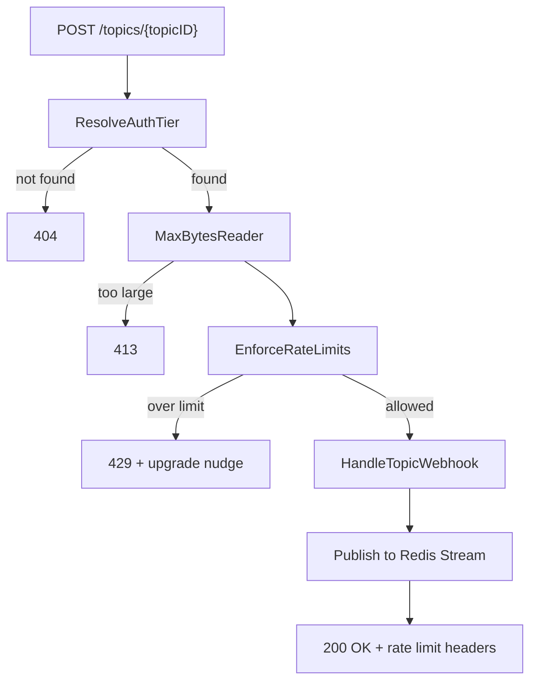
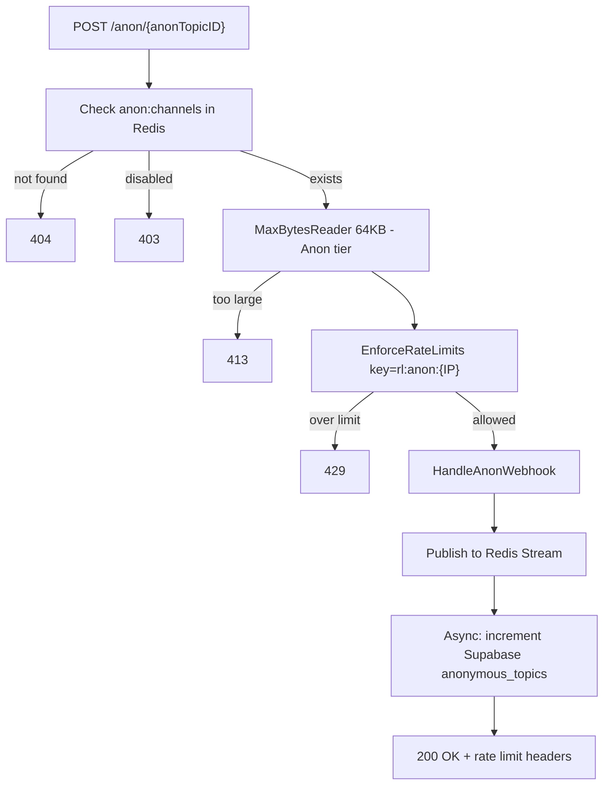

# Rate Limiting for Ingest Server

## Current State

The ingest server ([backend/ingest/main.go](backend/ingest/main.go)) has a single route `POST /webhooks/{topicId}` that accepts any topic ID without validation, rate limiting, or payload size checks. The only middleware is a request logger ([backend/ingest/internal/middleware/logger.go](backend/ingest/internal/middleware/logger.go)). The Redis client ([backend/ingest/internal/redis/client.go](backend/ingest/internal/redis/client.go)) only has `PublishWebhook`.

The relay service already has a Supabase client ([backend/relay/internal/supabase/client.go](backend/relay/internal/supabase/client.go)) using `supabase-community/supabase-go` that serves as a reference.

## Route Split

Replace the single `/webhooks/{topicId}` with two explicit routes:

- `**/topics/{topicID}**` — Authenticated topics stored in Supabase. Tier resolved from the topic owner's subscription.
- `**/anon/{anonTopicID}**` — Ephemeral anonymous topics created by `hookie listen` (CLI). Always Anon tier. Validated against Redis `anon:channels`.

This eliminates the need for ambiguous tier resolution — the route itself determines the tier class.

## Architecture

**Authenticated route:**



**Anonymous route:**



## Anonymous Topic Tracking

Anonymous topics are ephemeral (created by CLI, max 2 hours), but we track them in Supabase for analytics and abuse control.

### Supabase `anonymous_topics` table

```sql
create table public.anonymous_topics (
  id text primary key,              -- the anon topic ID (e.g. anon_xxxx)
  ip_address text not null,
  created_at timestamptz not null default now(),
  last_used_at timestamptz not null default now(),
  request_count bigint not null default 0,
  disabled boolean not null default false
);

create index idx_anon_topics_ip on public.anonymous_topics (ip_address);
create index idx_anon_topics_disabled on public.anonymous_topics (disabled) where disabled = true;
```

### Tracking flow

1. **Topic creation** (CLI runs `hookie listen` without auth): CLI registers topic in Redis `anon:channels` AND inserts a row into `anonymous_topics` (id, ip_address, request_count=0).
2. **Each webhook hit** to `/anon/{id}`: after publishing to the Redis stream, fire-and-forget an async Supabase call: `UPDATE anonymous_topics SET request_count = request_count + 1, last_used_at = now() WHERE id = $1`.
3. **Disabled check**: on each `/anon/{id}` request, check `anon:meta:{id}` hash in Redis for a `disabled` field. If `true`, return 403. When an admin disables a topic in Supabase, a DB trigger (or manual action) sets `disabled=true` in the `anon:meta:{id}` hash. This keeps the hot path in Redis.
4. **Topic expiry**: when the CLI disconnects or the 2-hour TTL expires, Redis removes the entry from `anon:channels`. The Supabase row persists for historical analytics.

## New Files

All under `backend/ingest/internal/`:

- `**ratelimit/tier.go` — Tier struct, default constants (Anon/Starter/Pro/Scale), Enterprise custom override loading
- `**ratelimit/limiter.go` — `CheckRateLimit()` (sorted set sliding window) and `EnforceRateLimits()` (minute + day)
- `**ratelimit/resolver.go` — `ResolveAuthTier()`: cache check -> Supabase topic->app->user/org->subscription lookup -> Enterprise override check -> cache set
- `**middleware/ratelimit.go` — Two middleware constructors: `ForTopics()` (resolves tier from Supabase) and `ForAnon()` (hardcoded Anon tier, checks `anon:channels` + disabled)
- `**supabase/client.go` — Supabase client for ingest: `LookupTopicTier()`, `GetEnterpriseOverrides()`, `IncrementAnonTopicCount()`
- `**handlers/anon.go` — `HandleAnonWebhook` handler (validates anon topic, publishes, async tracks)

## Modified Files

- [backend/ingest/go.mod](backend/ingest/go.mod) — Add `supabase-community/supabase-go` and `google/uuid`
- [backend/ingest/main.go](backend/ingest/main.go) — Replace single route with two routes, init Supabase client, wire per-route middleware
- [backend/ingest/internal/handlers/webhook.go](backend/ingest/internal/handlers/webhook.go) — Rename to `HandleTopicWebhook`, extract shared publish logic into a `publishToStream()` helper, read tier from context for `MaxBytesReader`, set `X-RateLimit-` headers
- [backend/ingest/internal/redis/client.go](backend/ingest/internal/redis/client.go) — Add `GetRedisClient()` to expose underlying client, add `CheckAnonTopic()` and `IsAnonDisabled()` helper methods

## Key Decisions

- **Two routes, two middlewares.** `/topics/` uses `ForTopics()` middleware (Supabase tier resolution). `/anon/` uses `ForAnon()` middleware (hardcoded Anon tier, Redis existence check). No ambiguity.
- **Tiers match pricing plans.** Anon (anonymous usage), Starter ($9), Pro ($29), Scale ($99), Enterprise (custom). Authenticated users without a subscription default to Starter. Enterprise limits are stored per-org in Supabase and set manually by the Hookie team.
- **Payload size checked after tier is known.** Middleware applies `http.MaxBytesReader` with the correct tier limit before the handler reads the body.
- **Async Supabase tracking for anon topics.** The `request_count` increment is fire-and-forget in a goroutine. If Supabase is slow or down, it does not block the webhook response. Counts may lag slightly — acceptable for analytics.
- **Disabled check stays in Redis.** The `anon:meta:{id}` hash is the source of truth at request time. Supabase `disabled` column is the admin interface. Propagation from Supabase to Redis can be a DB webhook or manual script initially.
- **Sliding window via sorted sets.** Same as master plan: `ZREMRANGEBYSCORE` + `ZADD` + `ZCARD` + `EXPIRE` in one pipeline. On rejection, `ZREM` the added member.
- **Tier cache for authenticated topics.** `tier:{topicID}` cached as a string with 5-min TTL. Anonymous topics skip this — always Anon tier.
- **Enterprise override.** When `ResolveAuthTier()` resolves to Enterprise, it fetches custom limits from an `organization_settings` JSONB column (or dedicated table). These are cached in Redis alongside the tier. If no custom overrides exist, Enterprise falls back to Scale limits as a safe default.

## Implementation Details

### Tier constants (`ratelimit/tier.go`)

Limits are derived from pricing page monthly quotas (e.g. Starter 50k/mo ~ 1,667/day) with headroom.

```go
type Tier struct {
    Name           string
    BurstPerMinute int64
    DailyQuota     int64
    MaxPayloadSize int64
}

// Default tiers — aligned with pricing plans
var (
    Anon    = Tier{"anon", 10, 100, 64 * 1024}           // anonymous usage via /anon route
    Starter = Tier{"starter", 60, 2_000, 256 * 1024}      // $9/mo — 50k webhooks/mo
    Pro     = Tier{"pro", 200, 20_000, 1 << 20}            // $29/mo — 500k webhooks/mo
    Scale   = Tier{"scale", 500, 200_000, 1 << 20}         // $99/mo — 5M webhooks/mo
    // Enterprise: custom limits per org, stored in Supabase
)

// TierByName resolves a tier string (from Stripe subscription) to a Tier.
// Authenticated users without a subscription default to Starter.
func TierByName(name string) Tier {
    switch strings.ToLower(name) {
    case "starter": return Starter
    case "pro":     return Pro
    case "scale":   return Scale
    default:        return Starter
    }
}

// EnterpriseOverride holds custom rate limits set by the Hookie team
// for a specific organization. Stored in Supabase org settings.
type EnterpriseOverride struct {
    BurstPerMinute int64 `json:"burst_per_minute"`
    DailyQuota     int64 `json:"daily_quota"`
    MaxPayloadSize int64 `json:"max_payload_size"`
}

// ToTier converts an enterprise override into a Tier.
// Falls back to Scale defaults for any zero/unset field.
func (o EnterpriseOverride) ToTier() Tier {
    t := Tier{Name: "enterprise"}
    t.BurstPerMinute = fallback(o.BurstPerMinute, Scale.BurstPerMinute)
    t.DailyQuota = fallback(o.DailyQuota, Scale.DailyQuota)
    t.MaxPayloadSize = fallback(o.MaxPayloadSize, Scale.MaxPayloadSize)
    return t
}
```

### Redis key convention

Rate limit keys mirror the URL routes — keyed by topic ID, not by tier or user. The tier doesn't need to be in the key because limits are resolved at request time and applied against the count.

```
rl:anon:{topicID}:min      — per-minute burst sorted set (anonymous)
rl:anon:{topicID}:day      — daily quota sorted set (anonymous)
rl:topics:{topicID}:min    — per-minute burst sorted set (authenticated)
rl:topics:{topicID}:day    — daily quota sorted set (authenticated)
```

Examples:

- `rl:anon:anon_k8f3x:min` / `rl:anon:anon_k8f3x:day` — anonymous topic
- `rl:topics:topic_abc123:min` / `rl:topics:topic_abc123:day` — authenticated topic

The key builder in the limiter:

```go
func RateLimitKey(prefix string, topicID string) string {
    return fmt.Sprintf("rl:%s:%s", prefix, topicID)
}
```

This is simple and scannable: `SCAN 0 MATCH rl:anon:*` for all anonymous rate limit keys, `SCAN 0 MATCH rl:topics:topic_abc123:*` for a specific topic's limits. Since limits are per-topic, a user upgrading their tier takes effect immediately — same keys, higher ceiling.

### Route registration (`main.go`)

```go
mux.Handle("/topics/{topicID}",
    middleware.ForTopics(resolver, limiter)(
        http.HandlerFunc(webhookHandler.HandleTopicWebhook),
    ),
)
mux.Handle("/anon/{anonTopicID}",
    middleware.ForAnon(redisClient, limiter, supabaseClient)(
        http.HandlerFunc(anonHandler.HandleAnonWebhook),
    ),
)
```

### Anonymous handler (`handlers/anon.go`)

```go
func (h *AnonHandler) HandleAnonWebhook(w http.ResponseWriter, r *http.Request) {
    anonTopicID := r.PathValue("anonTopicID")
    // Tier + rate limit result already set in context by ForAnon middleware
    tier := ratelimit.TierFromContext(r.Context())

    // Apply payload size limit
    r.Body = http.MaxBytesReader(w, r.Body, tier.MaxPayloadSize)

    // ... read body, build fields, publish to stream (shared logic) ...

    // Async tracking — fire and forget
    go h.supabaseClient.IncrementAnonTopicCount(context.Background(), anonTopicID)

    // Respond with rate limit headers
    setRateLimitHeaders(w, ratelimit.ResultFromContext(r.Context()))
    w.WriteHeader(http.StatusOK)
    json.NewEncoder(w).Encode(map[string]string{"status": "ok"})
}
```

### ForAnon middleware (`middleware/ratelimit.go`)

```go
func ForAnon(redisClient *redis.Client, limiter *ratelimit.Limiter) func(http.Handler) http.Handler {
    return func(next http.Handler) http.Handler {
        return http.HandlerFunc(func(w http.ResponseWriter, r *http.Request) {
            anonTopicID := r.PathValue("anonTopicID")

            // 1. Check anon:channels exists
            exists, _ := redisClient.ZScore(ctx, "anon:channels", anonTopicID).Result()
            if err == redis.Nil { respondError(w, 404, "topic not found"); return }

            // 2. Check disabled
            disabled, _ := redisClient.HGet(ctx, "anon:meta:"+anonTopicID, "disabled").Result()
            if disabled == "true" { respondError(w, 403, "topic disabled"); return }

            // 3. Rate limit by topic (Anon tier hardcoded)
            key := ratelimit.RateLimitKey("anon", anonTopicID) // → rl:anon:{topicID}
            result, _ := limiter.Enforce(ctx, key, ratelimit.Anon)
            if !result.Allowed { respond429(w, result); return }

            // 4. Store in context, call next
            ctx = ratelimit.WithResult(ctx, result)
            ctx = ratelimit.WithTier(ctx, ratelimit.Anon)
            next.ServeHTTP(w, r.WithContext(ctx))
        })
    }
}
```

### Response format on 429

```json
{
  "error": "rate_limit_exceeded",
  "message": "Daily quota exceeded. Upgrade at https://hookie.sh/pricing",
  "limit": 500,
  "window": "day",
  "retry_after": 42
}
```

For anonymous topics, the upgrade nudge is especially important — it converts active developers into paying users.

## Testing

- `**ratelimit/limiter_test.go**` — sliding window counts, rejection at limit+1, key auto-expiry, verify keys follow `rl:{prefix}:{topicID}:{window}` pattern
- `**ratelimit/resolver_test.go**` — cache hit returns cached tier, cache miss queries Supabase, unknown topic returns error, Enterprise override loaded from org settings
- `**handlers/anon_test.go**` — validates anon topic existence, disabled returns 403, async tracking fires
- `**middleware/ratelimit_test.go**` — integration tests: burst limit triggers on 11th req/min for Anon, daily quota triggers on 101st for Anon, oversized payload returns 413, correct `X-RateLimit-*` headers, unknown topic returns 404, Enterprise custom overrides applied
