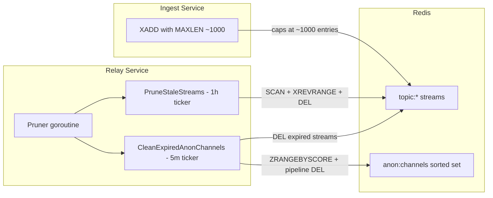

# Redis Stream Pruning

## 0. Rename Stream Keys to `topic:{topicID}`

Rename the stream key prefix from `webhook:events:` to `topic:` across the codebase to align with the master plan and future functionality.

**Changes (4 code files + 1 doc):**

- [backend/ingest/internal/handlers/webhook.go](backend/ingest/internal/handlers/webhook.go) line 70: `fmt.Sprintf("webhook:events:%s", topicId)` -> `fmt.Sprintf("topic:%s", topicId)`
- [backend/relay/internal/redis/subscriber.go](backend/relay/internal/redis/subscriber.go) line 76: `fmt.Sprintf("webhook:events:%s", topicID)` -> `fmt.Sprintf("topic:%s", topicID)`
- [backend/relay/internal/redis/subscriber.go](backend/relay/internal/redis/subscriber.go) line 99: `fmt.Sprintf("webhook:events:%s", topicID)` -> `fmt.Sprintf("topic:%s", topicID)`
- [backend/relay/internal/grpc/service.go](backend/relay/internal/grpc/service.go) lines 448-450: update comment and `prefix` variable from `"webhook:events:"` to `"topic:"`
- [backend/ingest/README.md](backend/ingest/README.md) line 88: update documentation reference

## 1.1 Write-Time MAXLEN on XADD

**File:** [backend/ingest/internal/redis/client.go](backend/ingest/internal/redis/client.go)

The single XADD call lives in `PublishWebhook()` (line 62). Add `MaxLen` and `Approx` to the `XAddArgs`:

```go
func (c *Client) PublishWebhook(ctx context.Context, streamKey string, fields map[string]interface{}) error {
	err := c.client.XAdd(ctx, &redis.XAddArgs{
		Stream: streamKey,
		MaxLen: 1000,
		Approx: true,
		Values: fields,
	}).Err()
```

This is a two-line change. No new files, no new dependencies.

## 1.2 Background Stale Stream Cleanup

**New file:** `backend/relay/internal/redis/pruner.go`

Create a `Pruner` struct that wraps a `*redis.Client`. This avoids coupling pruning logic to the `Subscriber` type.

- `NewPruner(client *redis.Client) *Pruner`
- `PruneStaleStreams(ctx, staleDuration) (int, error)` — scans `topic:`, checks last entry timestamp via `XREVRANGE ... COUNT 1`, deletes if older than `staleDuration` (48h)
- `CleanExpiredAnonChannels(ctx) (int, error)` — queries `anon:channels` sorted set for scores below `now`, pipeline-deletes `topic:{id}`, `anon:meta:{id}`, and the sorted set member
- `StartBackground(ctx)` — launches two tickers:
  - 1-hour ticker for `PruneStaleStreams`
  - 5-minute ticker for `CleanExpiredAnonChannels`
  - Both respect `ctx.Done()` for graceful shutdown

To give `Pruner` access to the underlying `*redis.Client`, add a `Client()` getter to `Subscriber`:

**File:** [backend/relay/internal/redis/subscriber.go](backend/relay/internal/redis/subscriber.go)

```go
func (s *Subscriber) Client() *redis.Client {
	return s.client
}
```

**Wire it into main.go:**

**File:** [backend/relay/main.go](backend/relay/main.go)

After initializing the subscriber (line 64), create and start the pruner:

```go
pruner := redis.NewPruner(subscriber.Client())
go pruner.StartBackground(context.Background())
log.Printf("Redis stream pruner started")
```

## 1.3 Anonymous Channel Cleanup

The `CleanExpiredAnonChannels` function is included in `pruner.go` (above) and wired into the background ticker. It is effectively a no-op until Feature 3 populates the `anon:channels` sorted set — the `ZRANGEBYSCORE` will return an empty slice and the function returns 0.

With the stream key rename (step 0), the pruner deletes `topic:{channelID}` — now consistent with the master plan.

## Logging

All pruning operations use structured `log.Printf` calls consistent with the rest of the codebase (no external logging library in use). Each prune cycle logs the count of deleted streams/channels, and errors are logged without crashing.

## Data Flow


